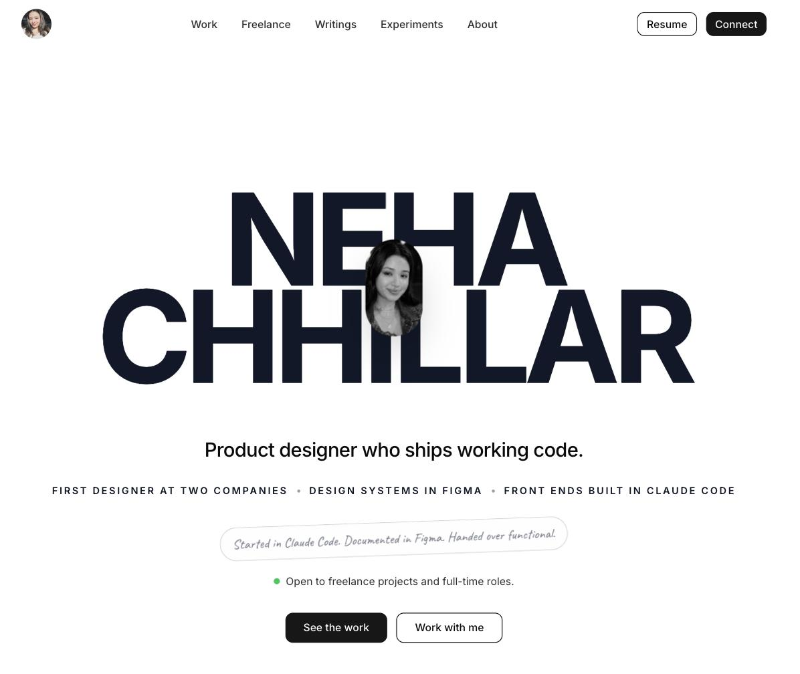

# nc-designs

My portfolio, designed and built by me.

**Live: [nc-designs.vercel.app](https://nc-designs.vercel.app)**

<p align="center">
  
</p>

Five case studies (Human Firewall, Airtel Travel Mode, eCrime Hub, Flashcard Training, unsaid), two long-form writing pieces, a resume viewer and a work-with-me page. Each case study is its own route, and its content lives in a typed data file, so the story can change without touching layout code.

## Built with

Next.js 16 (App Router), React 19, TypeScript, Tailwind CSS 4, shadcn/ui on Radix, Motion and GSAP, react-pdf, Vercel (hosting, Blob, Analytics). Built with Claude Code as a pair programmer.

## How it's organised

```
app/              Routes: home, /case-study/*, /writing/*, /resume, /work-with-me
components/       Page sections (header, work, about, testimonials, footer)
  case-study/     One component per case study, plus shared motion presets
  ui/             Reusable primitives: button, tabs, accordion, lightbox, scroll-driven effects
data/             Content for every page as typed TypeScript
lib/              Site config, hooks (reduced motion, hydration), helpers
design-system/    The written design system: tokens, type, motion rules, per-page overrides
scripts/          Generates the Open Graph images for each page
docs/             Screenshots and notes for this README
```

## Design decisions in code

- **One written source of truth.** `design-system/neha-portfolio/MASTER.md` records the real tokens from `globals.css` (colour, type, spacing, motion) and the voice rules. Page files in `design-system/.../pages/` override it where a case study needs its own look.
- **Content is data.** Case studies read from `data/*.ts`, so a copy edit never risks a layout change.
- **Motion respects the user.** A global `prefers-reduced-motion` rule plus a `use-reduced-motion-safe` hook tone animations down for anyone who has asked their OS for less motion.
- **One place for the domain.** `lib/site.ts` holds the site URL, and the sitemap, robots, canonical links and OG tags all derive from it.

## Run it locally

```bash
npm install
npm run dev     # http://localhost:3000
npm run build
```
